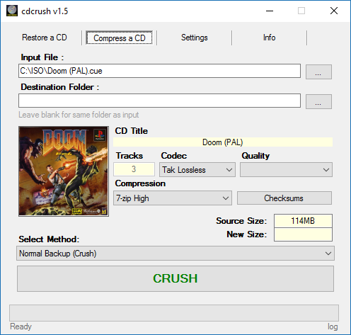
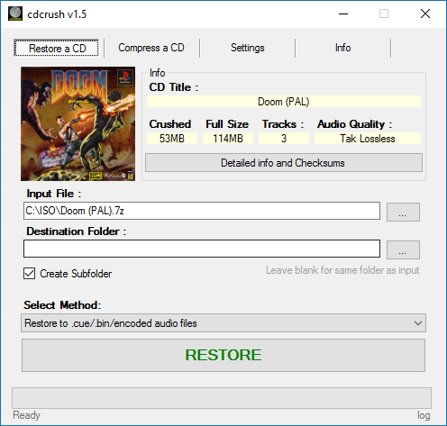
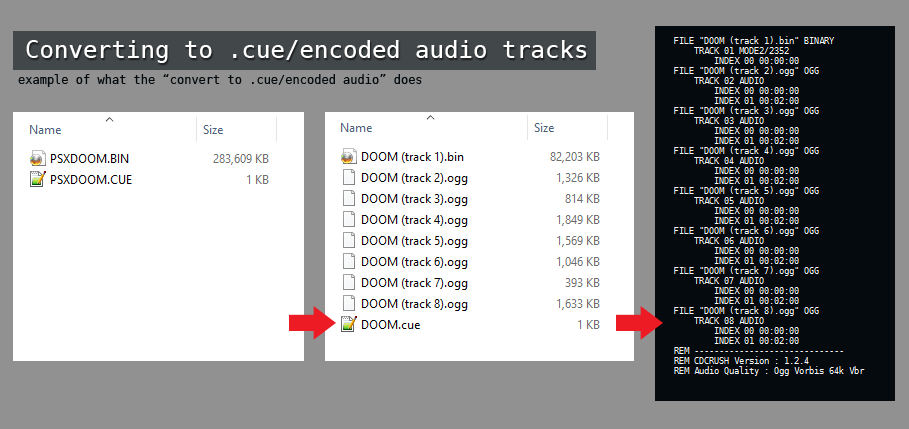
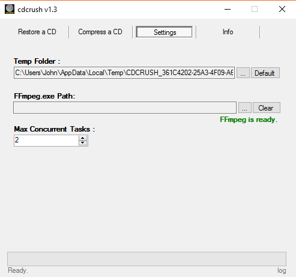

# CDCRUSH dot NET

**Name**: cdcrush, *Highy compress cd-image games*\
**Author:** John Dimi, <johndimi@outlook.com> *twitter*: [@jondmt](https://twitter.com/jondmt)\
**Project Page and Sources:** [https://github.com/johndimi/cdcrush.net](https://github.com/johndimi/cdcrush.net)\
**Language:** C# .NET 4.5, **Licence:** MIT\
**Version:** 1.3 **Platform:** Windows\
**Sister Project** : [cdcrush nodejs](https://www.npmjs.com/package/cdcrush)

## Download

To get the latest version check [the releases page here on github](https://github.com/johndimi/cdcrush.net/releases). \
Available for **windows** only.

## What is it

**cdcrush** is a tool that can highly compress **CD based games** *( playstation 1, Pc-engine, etc )* for storage / sharing purposes. **ALSO** it can encode the audio tracks of a CD and create a `.cue` file with *(mp3/ogg/flac)* tracks for use in emulators.

**⇒ How does it compress/crush a CD :** 

- The program separates the tracks of a CD image and compress them separately.
- For **data** tracks it will use **ecm tools** to remove Error Correction/Detection Codes (ECC/EDC) data from the sectors. *( redundant data )*
- For **audio** tracks, it will use an encoder of your choice. You can select a lossy encoder like (**opus** or **vorbis**) to produce a decent quality audio file with a much smaller filesize compared to the uncompressed PCM audio original.
- **OR** you can choose to encode audio with **FLAC**  which is lossless.
- Finally it compresses everything into a single `.arc` archive using the **FreeArc** archiver.
 
 **⇒ Restoring a crushed CD :**
 
**cdcrush**  can  **restore** the crushed CD image back to it's original form, a **.bin/.cue** image that is ready to be used however you like.  

**NOTE**: Archives with the audio tracks encoded with **FLAC**, will be restored to a 1:1 copy, byte for byte, of the original source CD
 
### Some examples of game sizes archived with 7zip and cdcrush:

| Title             |  Raw    | 7z      | cdcrush-ogg|  cdcrush-flac |
| ----------------- | ------- | ------  | -----------  | -------|
| Tomb Raider 2     |  710MB  |  ~ 455MB  | **150MB**  | **320MB** |
| Wipeout 3         |  577MB  |  ~ 490MB  | **77MB**   | .|
| Die Hard Trilogy  |  532MB  |  ~ 450MB  | **71MB**   | .|
| Alien Trilogy     |  507MB  |  ~ 440MB  | **88MB**   | .|

Those games feature many CD-DA audio tracks
7zip maximum compression default template

## USAGE

### General Info

- **cdcrush** is only compatible with `.cue/.bin` type CD images. Some programs that allow you to rip your CDs to this format are:
	- [cdrtfe](https://cdrtfe.sourceforge.io/cdrtfe/index_en.html), open source
	- [ImgBurn](http://imgburn.com) ,free but not open source.
- When selecting an **output folder** you will be asked to save a dummy file, that file will not ever be written and the program will select the folder of that file.
- You can download the release without **FFmpeg** if you already have it, just be sure to set it up in the `settings` tab.
- :star2: **NEW since 1.2.4** : You can see the detailed info of a CD along with the tracks checksum. When restoring a CD, click the `Detailed Info` button. And for when crushing a CD, the button will become active AFTER the operation is complete.
- :scroll: **NEW since 1.3** : Logging. You can click the `log` button on the bottom right of the window to open the main log. It's an advanced feature, use it in case something goes wrong to get more detailed info.

## :cd: Crushing a CD (*Compressing* )

- Select an input file ( **.cue** ). You can drop it in the window or click the **[...]** button to select one
- Optionally set an output folder, the final **.arc** file will be created there, auto-named after the CD title
- Optionally set a cover image by dropping a **.jpg** file in the window, or by clicking on the image placeholder
- Choose an **audio codec** and **bitrate** to encode the audio tracks with (*if any*)
- You can choose a compression level. The default is **4** and it's very solid. You can try experimenting, but **WARNING** :warning: don't go above **6** since you'll need HUGE amounts of RAM to encode and decode (*also it will take forever*)
- You can optionally change the CD Title, in case the automatic name is wrong
- **Leave** the `Convert to .Cue/Encoded audio` checkbox **UNTICKED**
- Press the **CRUSH** button
- Wait for the operation to end

## :arrows_clockwise: Restoring a CD

- Select a previously crushed archive ( **.arc** ) to be restored. You can drop it in the window or click the **[...]** button to select one
- Optionally set an output folder, the (**.cue/.bin**) files will be created there, auto-named after the CD title
- Check the `Create subfolder` checkbox to create a subfolder named after the CD title and put the restored CD image there
- Check the `Single bin/cue` to **force** restoring the CD back into a single bin file, even if the original source was a multi file bin/cue image
- **NEW** you can check the `Restore to .cue/Encoded audio` to restore the CD and leave the Audio Tracks encoded. Can be used with some emulators that support `.cue` files with encoded audio tracks.
- Press the **RESTORE** button
- Wait for the operation to end

## :cd: Converting to .cue/encoded audio

You can **convert** a `.cue/.bin` CD, into another `.cue/.bin` combo with **encoded audio tracks called from the cue file**. This is really useful if you want to play a CD in an emulator that supports loading `.cue` files with encoded audio tracks (*e.g. mednafen supports libvorbis and FLAC audio*)

To convert a CD, go to the **Compress a CD** screen and **tick** the`convert to .CUE/encoded Audio` checkbox, select the audio quality and click **CONVERT**. The new files are going to be generated under a subfolder to avoid overwriting the source .cue/.bin files.

Example of what this operation does.

> **NOTE**: This can also be achieved  when restoring a CD be ticking the `restore to .cue/encoded audio`

## :wrench: Settings tab

**Temp Folder** :
 You can set a custom temporary folder for the various background processes like FFmpeg. Useful if you have a RAMDRIVE. \
 :warning: **WARNING** : Make sure the temp folder can hold up to 1.2GB of data !

**FFmpeg Path** :
Point to the location of `ffmpeg.exe` , it is needed for encoding/decoding the audio tracks. If you have `FFmpeg` set on the system/user PATH, it will be checked once you **clear** the custom path.

**Max Concurrent Tasks**:
How many tracks to process at the same time. *(For when compressing or restoring with ffmpeg and ecm tools)*

## :exclamation: CHANGELOG
See [`CHANGELOG.MD`](CHANGELOG.MD)

## :clipboard: Q&A

**Q** : Why?\
**A** : I wanted to save space on my hard drive and I think it's a decent way to store CD images, better than just compressing with 7zip or Rar. Also It was a good programming practice.

**Q** : Does it support games from SegaCD, Jaguar, 3DO, X, Y?\
**A** : Theoretically it should support all valid **.cue/.bin** files, try it out.

**Q** : I am worried about the audio quality.\
**A** : The OGG vorbis (also new **OPUS**) codec is decent and it can produce very good results even at 96kbps. **However** if you don't want any compressed audio you can select the **FLAC** encoder, which is lossless.

**Q**: Is storing the entire CD with FLAC really lossless? I am worried about byte integrity.\
**A**: YES, to the last byte. The filesize and checksums of the restored tracks are the same as the original ones. (data&audio). You can check for yourself by calculating the checksums of restored files vs original source. **ALSO Checksum reports** ~~are coming at a later version~~ implemented since v.1.2.4

**Q** : Why there are two versions of the program?\
**A** : FFmpeg.exe is a small beast ( *around 36 megabytes*) and in some cases users already have it on their pc. So I am publishing a version with and a version without it.

## NodeJS Version

This project is a continuation of [**cdcrush nodeJS**](https://www.npmjs.com/package/cdcrush).  

**NEW APRIL 2018** :: I updated the **nodejs** version of **cdcrush** and it's compatible with the **.net** version. Meaning that archives created with **.net** can be opened with **.nodejs** and vice versa.

> :stars: **nodejs** version support **batches** , so you can restore/compress multiple CD with one command.

You can checkout **nodejs** version over at NPM : https://www.npmjs.com/package/cdcrush

## About

Feel free to provide feedback and contact me on social media and email. Donations are always welcome! :smile:

Thanks for checking this out,\
John.
